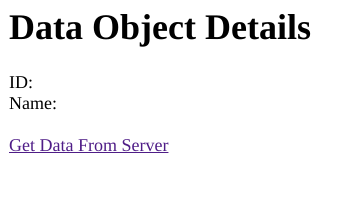
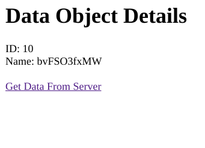
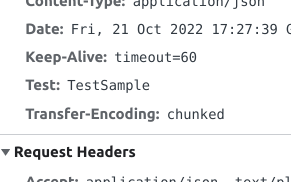

# Лабораторная № 4
Необходимо написать две программы (клиент и сервер) с использованием библиотеки
Spring Boot. Клиент должен вызывать API сервера, используя прокси Zuul. Также в рамках
лабораторной работы необходимо написать пользовательский фильтр Zuul.

# Демонстрация работы
#### 1. Запрос через прокси при выключенном сервере:

#### 2. Запрос при включенном сервере:

#### 3. Заголовок от фильтра в запросе:

